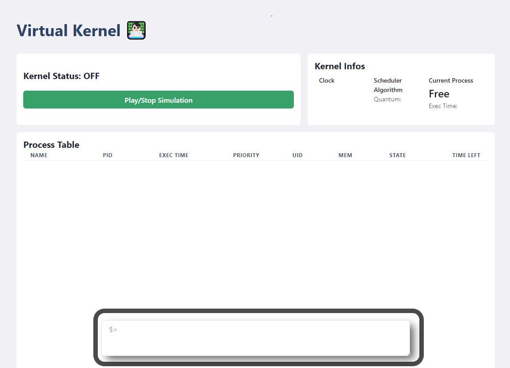
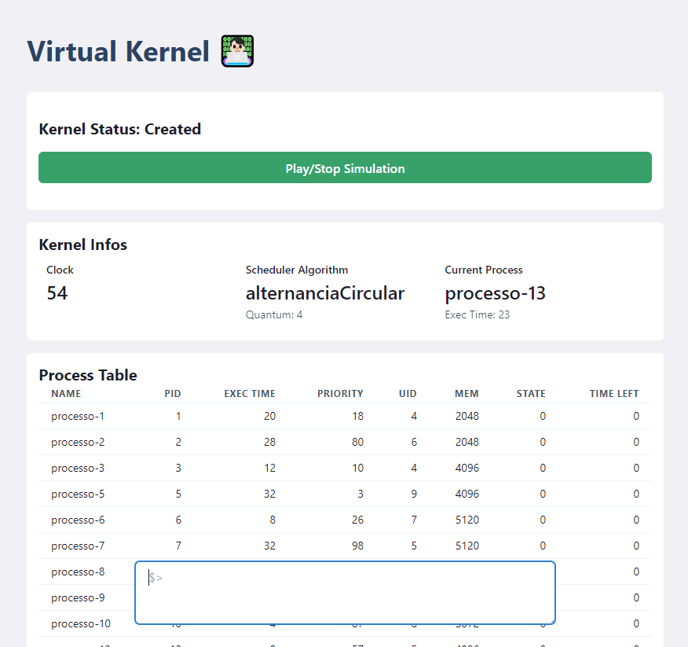

<h1 align="center">Bem-vindo ao miniso-124827 👋</h1>
<p>
  
  <a href="#" target="_blank">
    
  </a>
</p>

> mini sistema operacional implementado na disciplina de Sistemas Operacionais - 2020 - FURG

## Dependências

```json
{
  "nodejs": "^12.x",
}
```

## Instalando dependências NodeJS

```python
yarn install or npm install
```

## Iniciar Projeto

```python
yarn dev or npm run dev
```

# Uso

Ao se iniciar o projeto, em um terminal, uma mensagem semelhante será exibia, basta acessar uma das URLs através de seu navegados para obter acesso a aplicação.

Caso deseje utilizar o gerenciador de memória, basta clicar no link Memory, no canto superior direito.

```bash
ready - started server on 0.0.0.0:3000, url: http://localhost:3000
```
Insira o conteudo do arquivo de entrada no teminal flutuante.



Aprecie a vista!



# Sobre

## Web

O projeto web foi desenvolvido em React e NextJS, e o ponto de entrada para a aplicação é o arquivo `src/pages/index.tsx`

## Kernel

Aqui foi desenvolvida toda a regra de negocio do kernel, o ponto de entrada para a aplicação é o arquivo `src/services/kernel/index.ts`

## Autor

👤 **Wilgnne Khawan <wilgnne.kba@gmail.com>**

***
_This README was generated with ❤️ by [readme-md-generator](https://github.com/kefranabg/readme-md-generator)_
